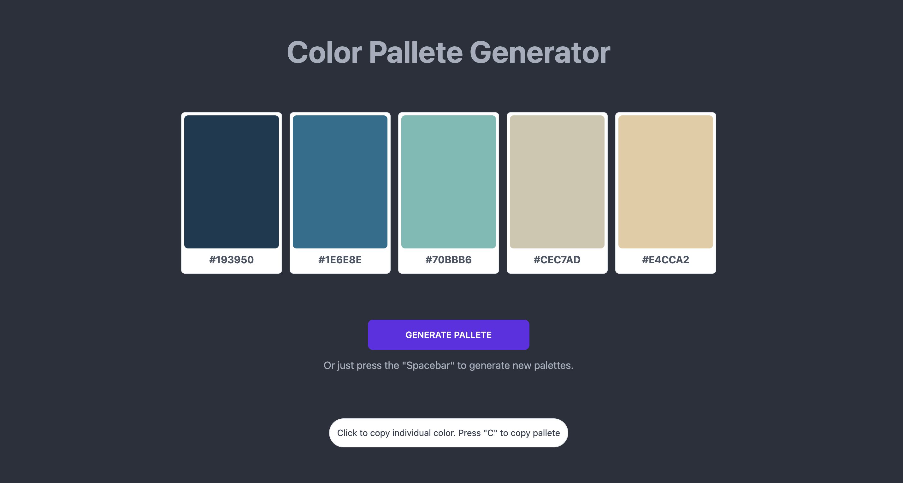
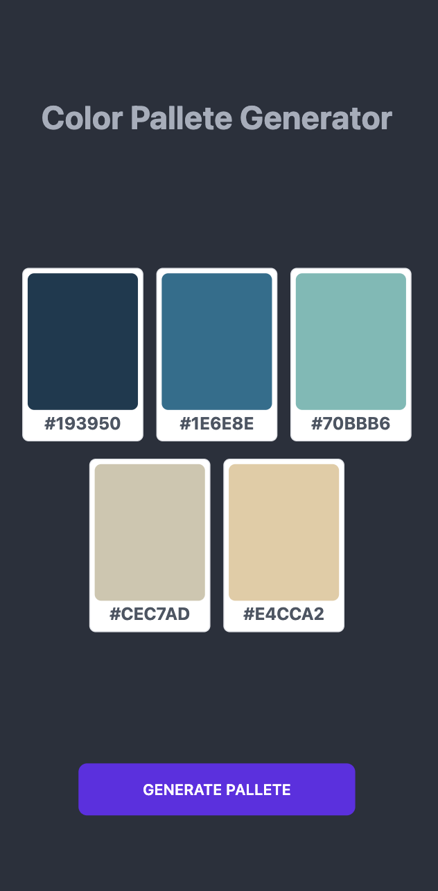

# Color Palette Generator 

The Color Palette Generator is a web application that generates a set of five color palettes using the Colormind API. Users can generate new palettes by clicking a button or pressing the spacebar key, and they can copy the hexadecimal values of individual colors by clicking on a card displaying that color. The application uses Vue.js, Tailwind CSS, and DaisyUI for the front-end, and Axios for API requests.

## Desktop View


## Mobile View


## How to Use

1. Initially, the page will show a loading spinner. Wait for a few moments for the page to finish loading.
2. Once the page has loaded, you will see five color cards, each displaying a different color.
3. You can click on the "Generate Palette" button to generate a new set of colors. Alternatively, you can press the "Spacebar" key on your keyboard to generate a new set of colors.
4. To copy a color's hex code to your clipboard, click on the corresponding color card. A message will appear confirming that the color has been copied to your clipboard.
5. You can paste the copied hex code wherever you like, such as in a design software or on a website.
6. To generate another palette, simply repeat steps 4-6.

## Accessing the Project

Currenlty the web application can't be deployed due to an issue with the used api. The Colorbind api has no ssl implemented in the endpoint used. Therefore, this web application can't be deployed until the used api have ssl implemented into it's endpoints. To use this project, feel free to clone it in your personal machine.

## Technologies Used
1. Vue.js: a progressive JavaScript framework for building user interfaces.
2. Axios: a promise-based HTTP client for the browser and Node.js.
3. DaisyUI: a component library for tailwind CSS that provides ready-to-use UI components.
4. Tailwind CSS: a utility-first CSS framework that allows developers to rapidly build custom user interfaces.

## Project Setup

```sh
npm install
```

### Compile and Hot-Reload for Development

```sh
npm run dev
```

### Compile and Minify for Production

```sh
npm run build
```